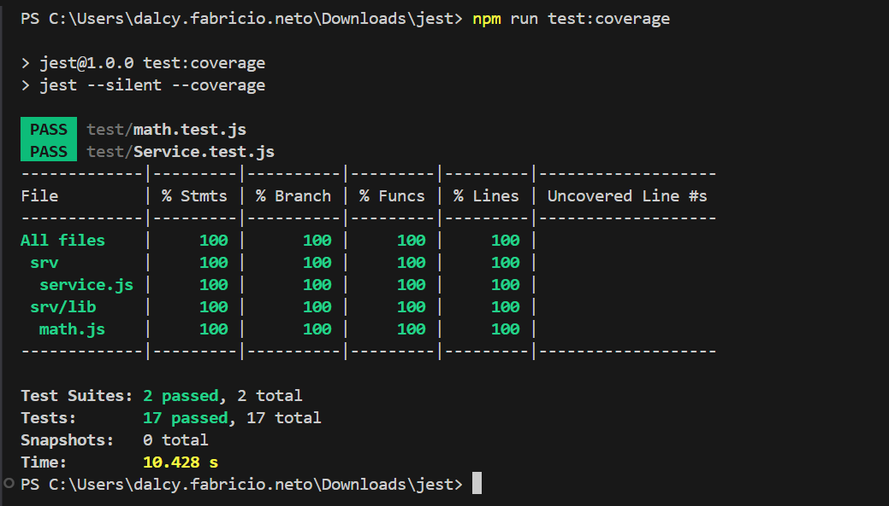

# Primeiros Passos

Bem-vindo ao seu novo projeto.

Ele contém estas pastas e arquivos, seguindo a nossa estrutura de projeto recomendada:

Arquivo ou Pasta | Finalidade
---------|----------
`app/` | conteúdo para os frontends de UI vai aqui
`db/` | seus modelos de domínio e dados vão aqui
`srv/` | seus modelos de serviço e código vão aqui
`test/`| pasta contém o http e testes 
`package.json` | metadados e configuração do projeto
`readme.md` | este guia de primeiros passos

## Próximos Passos
- Abra um novo terminal e execute `npm install`
- Após o `npm install` execute `cds deploy`
- Após o  `cds deploy` e execute `cds watch`

## Executar testes
- Abra um terminal e execute `npm test` ou `npm run test:coverage` para testes de cobertura

Exemplo:

## Saiba Mais

Saiba mais em https://cap.cloud.sap/docs/get-started/.
